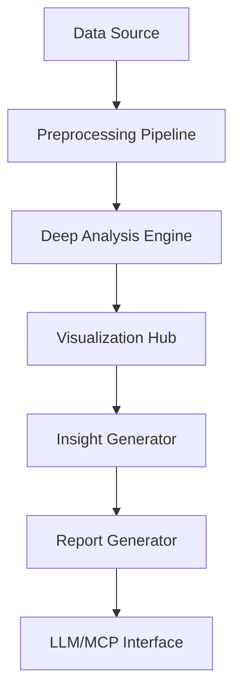

### **E.D.A - Extended_Deep_Awareness** MCP Tool Project Plan  
**Objective:** Create a comprehensive MCP (Model Context Protocol) tool that performs **Extended Deep Awareness (EDA)** analysis on datasets, going beyond traditional exploratory data analysis to uncover hidden patterns, correlations, and actionable insights using advanced AI/ML techniques.

---

### **1. Core Architecture**  
#### **Modular Components**  
| **Module**               | **Functionality**                                                                 | **Tech Stack**                          |
|--------------------------|-----------------------------------------------------------------------------------|-----------------------------------------|
| **Data Ingestion Engine** | Ingest data from multiple sources (CSV, JSON, SQL, APIs, cloud storage).          | `pandas`, `SQLAlchemy`, `boto3` (AWS)   |
| **Preprocessing Pipeline** | Clean data, handle missing values, encode features, normalize/standardize.       | `scikit-learn`, `NumPy`, `missingno`    |
| **Deep Analysis Engine**  | Perform statistical, ML, and NLP-based analysis.                                 | `SciPy`, `statsmodels`, `spaCy`, `BERT` |
| **Visualization Hub**     | Generate interactive charts, 3D plots, and network graphs.                        | `Plotly`, `Matplotlib`, `Seaborn`, `D3.js` |
| **Insight Generator**     | Extract actionable insights using LLMs (e.g., GPT-4, Claude).                     | `OpenAI API`, `LangChain`               |
| **Report Generator**      | Export reports in PDF, HTML, Markdown, or interactive dashboards.                | `Jinja2`, `WeasyPrint`, `Dash`          |
| **MCP Interface**         | Expose tool as an MCP server for LLM integration.                                | `mcp-sdk-python`                        |

---

### **2. Key Features**  
#### **A. Multi-Source Data Ingestion**  
- **Supported Formats:** CSV, JSON, Parquet, SQL (PostgreSQL, MySQL), APIs (REST), AWS S3, Google Cloud Storage.  
- **Auto-Detection:** Automatically detect schema, data types, and encoding.  

#### **B. Advanced Preprocessing**  
- **Cleaning:** Remove duplicates, handle outliers (IQR/Z-score), impute missing values (KNN, regression).  
- **Transformation:** Log scaling, PCA, one-hot encoding, text vectorization (TF-IDF, Word2Vec).  
- **Anomaly Detection:** Isolation Forest, Autoencoders.  

#### **C. Deep Analysis Capabilities**  
| **Analysis Type**       | **Techniques**                                                                 |
|------------------------|--------------------------------------------------------------------------------|
| **Statistical**        | Hypothesis testing (t-test, ANOVA), distribution analysis (Shapiro-Wilk).      |
| **Time-Series**        | Trend decomposition, seasonality analysis (STL), forecasting (Prophet, LSTM).  |
| **NLP**                | Sentiment analysis, topic modeling (LDA), named entity recognition (NER).       |
| **Graph Analysis**     | Network centrality, community detection (Louvain), relationship mapping.       |
| **ML Insights**        | Feature importance (SHAP values), clustering (K-Means, DBSCAN), classification. |

#### **D. Intelligent Visualization**  
- **Dynamic Charts:** Interactive scatter plots, heatmaps, violin plots.  
- **3D/Network Graphs:** 3D PCA projections, knowledge graphs.  
- **Auto-Insight Overlays:** Highlight key patterns directly on visualizations.  

#### **E. LLM-Powered Insights**  
- **Natural Language Explanations:** Use LLMs to translate findings into human-readable summaries.  
- **Recommendation Engine:** Suggest next steps (e.g., "Try feature engineering on column X").  
- **Q&A Interface:** Allow users to ask questions about the dataset (e.g., "What drives customer churn?").  

#### **F. Reporting & Export**  
- **Templates:** Pre-built report templates (executive summary, technical deep-dive).  
- **Formats:** PDF, HTML, Markdown, interactive web dashboards (Dash/Streamlit).  
- **Automation:** Schedule reports via cron or CI/CD pipelines.  

---

### **3. MCP Integration**  
#### **MCP Server Implementation**  
- **Protocol:** Implement the MCP specification to expose EDA as a tool for LLMs (e.g., Claude, ChatGPT).  
- **Endpoints:**  
  - `analyze_data`: Trigger full EDA pipeline.  
  - `visualize`: Generate specific plots.  
  - `ask_question`: Answer natural language queries about the data.  
- **Example LLM Prompt:**  
  ```python
  # MCP Tool Call
  tools = [{
    "name": "eda_extended_deep_awareness",
    "parameters": {
      "data_source": "s3://my-bucket/data.csv",
      "analysis_depth": "deep",  # [basic, intermediate, deep]
      "insights_type": "business"  # [statistical, business, technical]
    }
  }]
  ```

---

### **4. Workflow**  
1. **Data Ingestion:** User provides data source (file, API, DB).  
2. **Preprocessing:** Auto-clean and transform data.  
3. **Deep Analysis:** Run statistical, ML, and NLP modules.  
4. **Visualization:** Generate interactive plots.  
5. **Insight Generation:** LLM summarizes findings and suggests actions.  
6. **Export:** Deliver report via MCP or download.  



---

### **5. Tech Stack Details**  
- **Language:** Python 3.10+  
- **Core Libraries:**  
  - Data: `pandas`, `Dask` (for large datasets)  
  - ML: `scikit-learn`, `XGBoost`, `PyTorch` (for custom models)  
  - NLP: `spaCy`, `Hugging Face Transformers`  
  - Visualization: `Plotly`, `Seaborn`, `PyVis` (network graphs)  
- **MCP:** `mcp-sdk-python`  
- **Deployment:** Docker, Kubernetes (for scalability)  

---

### **6. Example Use Cases**  
1. **Business Analytics:**  
   - Input: Sales data (CSV).  
   - Output: "Q3 revenue dropped 15% due to low sales in Region X. Recommend targeting demographics Y."  
2. **Healthcare:**  
   - Input: Patient records (JSON).  
   - Output: "Patients with condition Z show 70% higher readmission risk. Monitor lab values A and B."  
3. **NLP on Reviews:**  
   - Input: Customer feedback (text).  
   - Output: "Sentiment is negative (68%). Key complaints: delivery speed (45%), product quality (30%)."  

---

### **7. Development Roadmap**  
| **Phase** | **Timeline** | **Deliverables**                                                                 |
|-----------|--------------|----------------------------------------------------------------------------------|
| **1**     | 2 weeks      | Data ingestion + preprocessing pipeline; basic statistical analysis.             |
| **2**     | 3 weeks      | ML/NLP modules; visualization hub; MCP server skeleton.                          |
| **3**     | 2 weeks      | LLM integration; insight generator; PDF/HTML reporting.                          |
| **4**     | 1 week       | Testing (unit/integration); documentation; example use cases.                    |
| **5**     | 1 week       | Deployment (Docker); CLI tool; MCP certification.                                |

---

### **8. Testing Strategy**  
- **Unit Tests:** `pytest` for each module.  
- **Integration Tests:** End-to-end pipeline with sample datasets.  
- **LLM Validation:** Compare AI-generated insights against ground-truth analysis.  
- **Performance:** Test with 1M+ rows using `Dask`.  

---

### **9. Documentation**  
- **User Guide:** How to use via CLI, MCP, or web UI.  
- **API Docs:** MCP endpoints and parameters.  
- **Examples:** Jupyter notebooks for common workflows.  
- **Contribution Guide:** For community extensions.  

---

### **10. Future Enhancements**  
- **Real-Time Analysis:** Stream processing with `Apache Kafka`.  
- **AutoML:** Integrate `Auto-sklearn` for automated model selection.  
- **Multi-Modal Data:** Support images/audio (e.g., analyze satellite imagery + tabular data).  
- **Explainable AI:** SHAP/LIME integration for model transparency.  

--- 

**Final Output:** A production-ready MCP tool that transforms raw data into strategic insights through deep AI-driven analysis, accessible via LLMs or standalone use. Let’s build this! 🚀